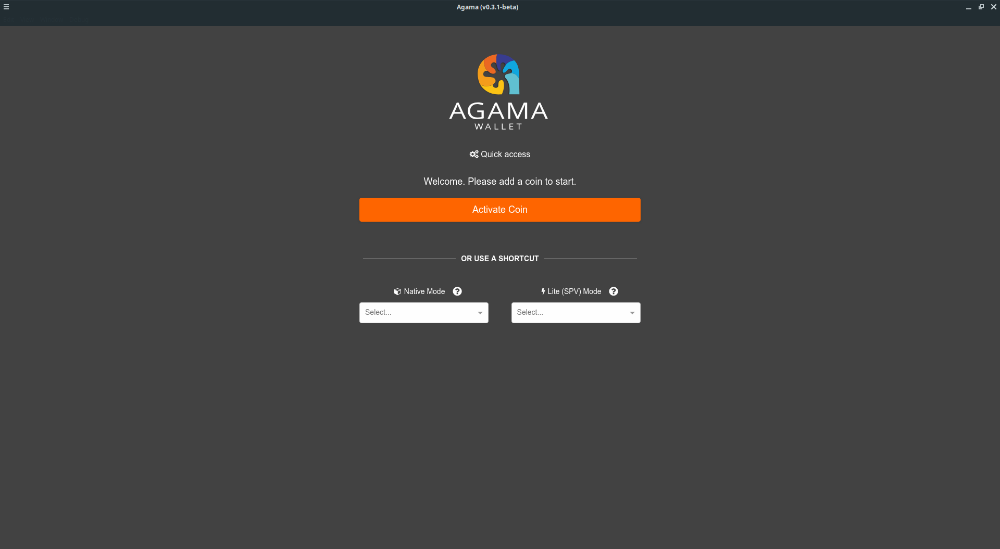
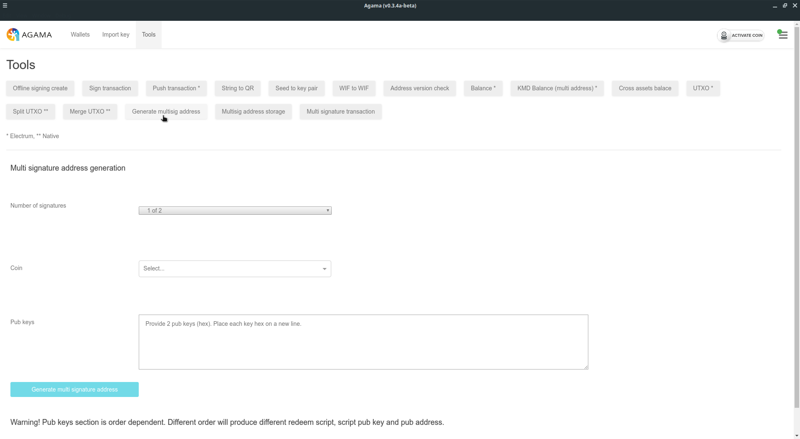
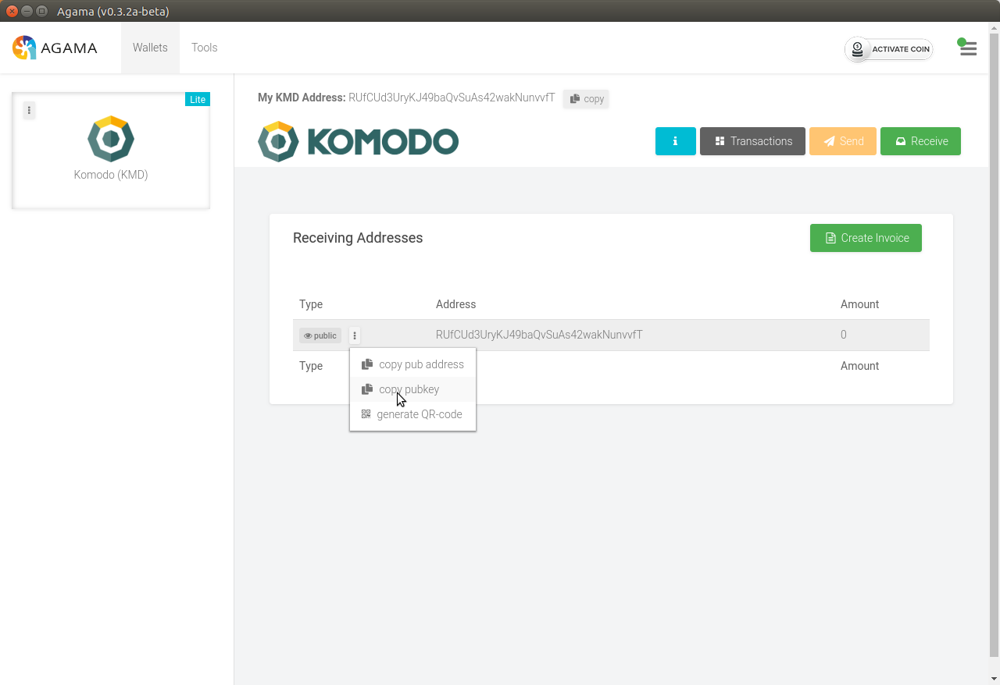
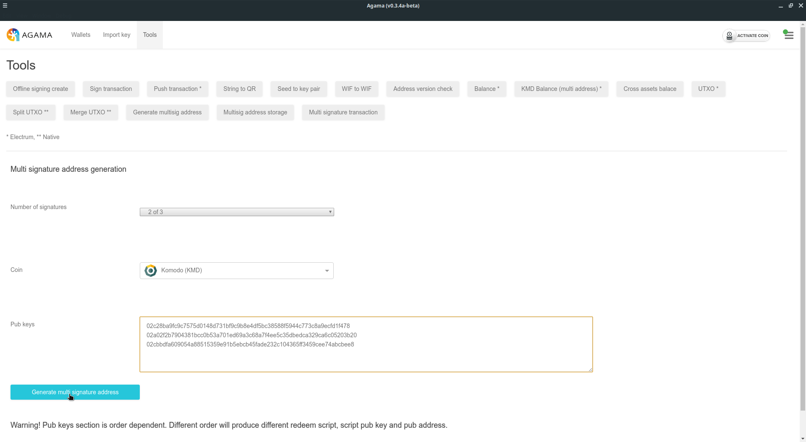

# Generate a multisig address using Agama

First step to generate a multisig address in Agama is to download latest Agama release: [Download Agama Wallet](https://komodoplatform.com/komodo-wallets/)

After downloading Agama for your preferred OS, run it and select `Activate Coin`:

After you activate your favorite coin in lite mode, go to `Tools` section and select `Generate multisig address`

:::tip Note
If you don’t see Tools section, follow this guide to activate Advanced features <https://support.komodoplatform.com/en/support/solutions/articles/29000024423-activate-advanced-features>
:::



:::tip Note
A multisig address is a special address that will require different people to sign each transaction with their own private keys. To create a multisig address you will need all your peers to share with you the pubkey which will be used to sign transactions (these public-keys and their corresponding private-keys should be very well backed up by each owner). You can find your `pubkey` from the `receive` section as shown in the following image.
:::



## Generating the address

- In the `Generate multisig address` section, you can select how many total `pubkeys` you will want as signers and how many signers will be needed to make a transaction.

- For example if you select `2 of 3`, you will have 3 total `pubkeys` that can sign but at least 2 will be needed to make a transaction.

- Next, select which coin you will be making this address for.

- Finally, list all 3 (or total of keys needed) in the text box.



Once you generate the multisig address, you will get several outputs:

- **Address**: `bQE41eaXq2eC2jWtM95XqWe8TRNF8uVjv5`

- **Redeem script**:

```bash
522102c28ba9fc9c7575d0148d731bf9c9b8e4df5bc38588f5944c773c8a9ecfd1f4782102a02f2b7904381bcc0b53a701ed69a3c68a7f4ee5c35dbedca329ca6c05203b202102cbbdfa609054a88515359e91b5ebcb45fade232c104365ff3459cee74abcbee853ae
```

- **Script pub key**: `a9147e1adc17cf2c33f516b222b83eb4f8f53e088a0887`

- **and finally the complete script you will need to use for future transactions**:

```json
{
  "redeemScript": "522102c28ba9fc9c7575d0148d731bf9c9b8e4df5bc38588f5944c773c8a9ecfd1f4782102a02f2b7904381bcc0b53a701ed69a3c68a7f4ee5c35dbedca329ca6c05203b202102cbbdfa609054a88515359e91b5ebcb45fade232c104365ff3459cee74abcbee853ae",
  "scriptPubKey": "a9147e1adc17cf2c33f516b222b83eb4f8f53e088a0887",
  "nOfN": "2-3",
  "messageSecret": "438e24da3db1407e040d86ab8462750e9125448994909d29407937931c076d53",
  "messageCID": "040d86ab8462750e438e24da3db1407e",
  "pubKeys": [
    "02c28ba9fc9c7575d0148d731bf9c9b8e4df5bc38588f5944c773c8a9ecfd1f478",
    "02a02f2b7904381bcc0b53a701ed69a3c68a7f4ee5c35dbedca329ca6c05203b20",
    "02cbbdfa609054a88515359e91b5ebcb45fade232c104365ff3459cee74abcbee8"
  ]
}
```

:::tip Note
Store this information as well as possible, you can distribute it between your peer signers so that each one can store this information. This will be vital for moving funds from this address.
:::

Now you have a multisig address with no funds in it. You have to use the `Multi-signature transaction` section to be able to send from the multisig address as shown [here.](./sign-multisig-transaction.md)
