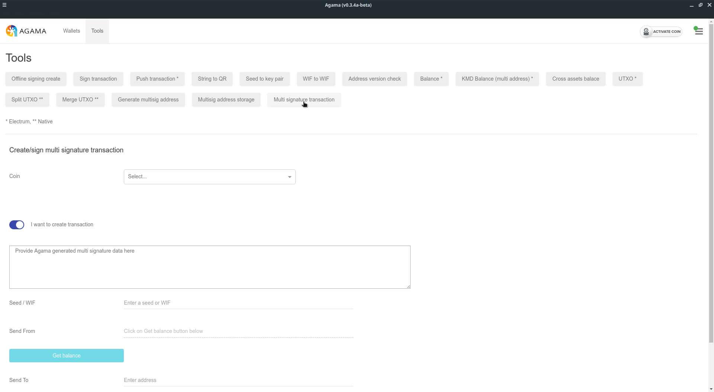
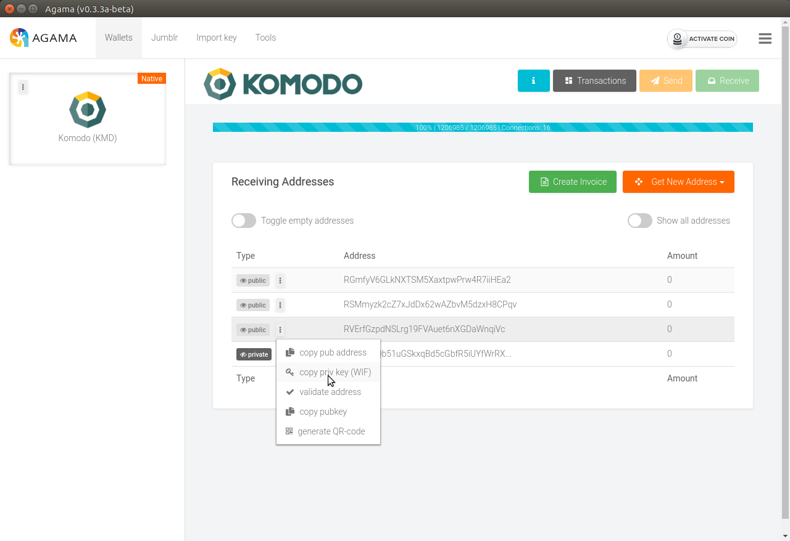
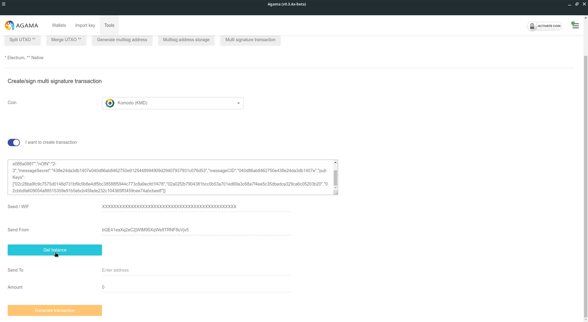
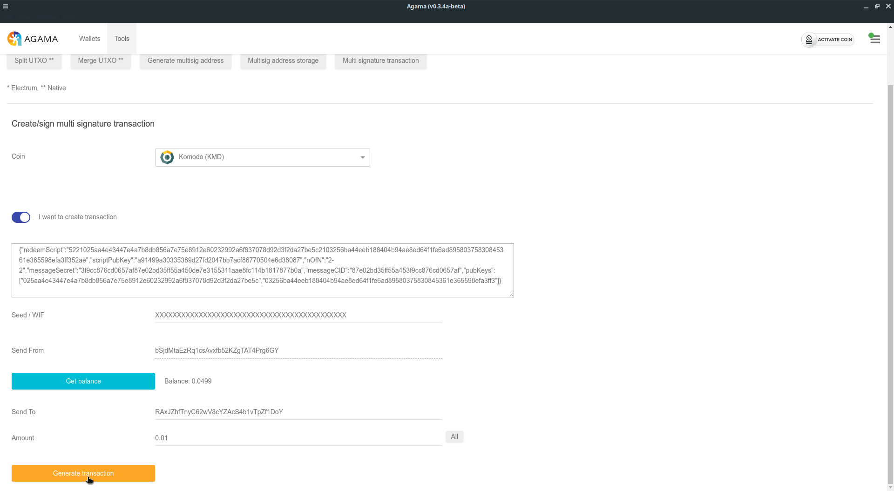
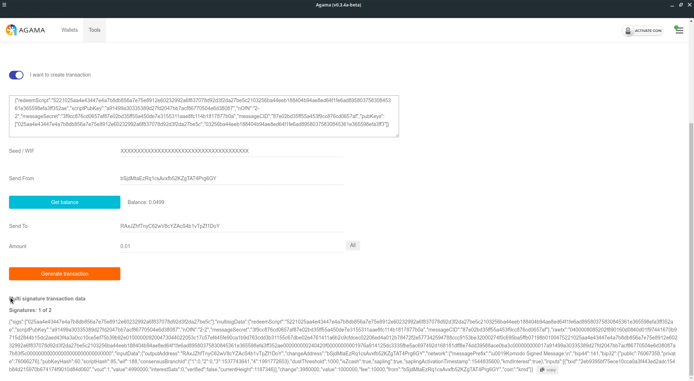
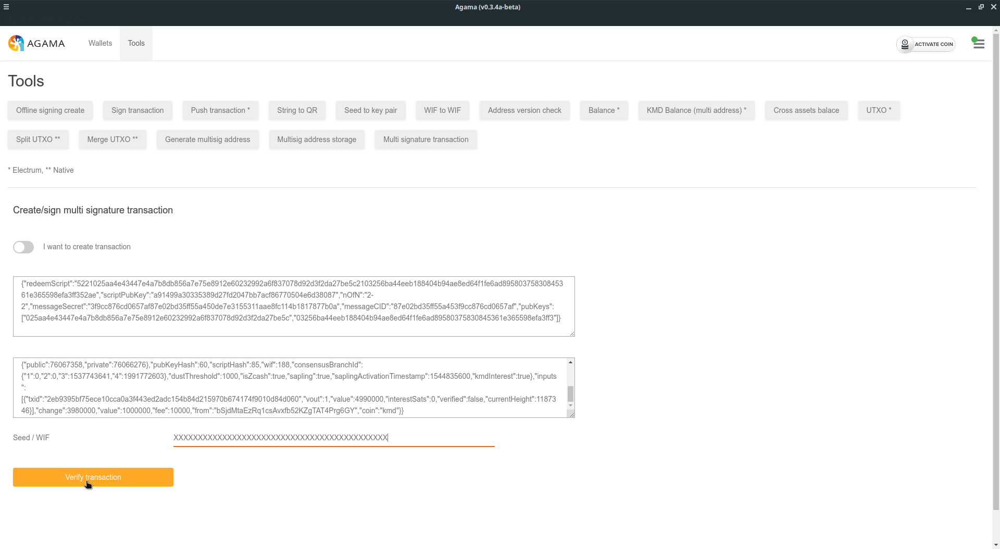

# Sign multisig transaction in Agama

Refer to this [doc](./create-multisig-address.md) to learn about creating a multisig-address.

First step to sign a multisig transaction in Agama is to download latest Agama release:

[Download Agama Wallet](https://komodoplatform.com/komodo-wallets/)

After downloading Agama for your preferred OS, run it and select `Activate Coin`:

After you activate your favorite coin in lite mode using the `private key (WIF or seed)`, go to `Tools` section and select `Multi signature transaction`

:::tip Note
A multisig address is a special address that will require different people to sign each transaction with their own `private keys (WIF or seed)`. To create a multisig transaction you will need all your peers to sign the transaction before it can be broadcasted. To sign the transaction, each peer will need the `private key (WIF or seed)` of the `pubkey` that was used to create the multisig address which can be found here if you use native mode, in lite mode the seed will be the same you logged in with
:::

In `Multi signature transaction` section, if you are the person creating the transaction, you will select the coin used for the multisig address, then input the multisig address `complete script` (the json that is output by agama when the multi-sig address was being created), the `private key (WIF or seed)` of the signer's address and click the `Get balance` button:

Once you press the `Get balance` button, the `Send From` and Balance entries are displayed. Verify that the address displayed at `Send From` is the correct multisig address.

Then enter the `Send To` address and the `Amount` to be sent.

Click on `Generate transaction`

The final output has to be copied and shared with the other signers who need to sign the transaction too:

Now with this output, the next signer will need to do a similar process, but this time the `I want to create a transaction` button toggled off.

The subsequent signers will just need to set the `complete script` of the multisig address, the output of the previous signer and their `private key (WIF or seed)`:

Once you click `Verify transaction`, an option to **Push the transaction** will show and you will be able to send the transaction **IF** all the required signatures are done. If any other signature is required then this process will need to be repeated by the remaining number of signers needed.
