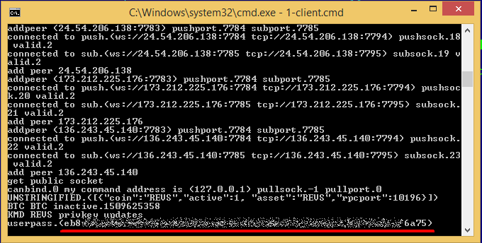
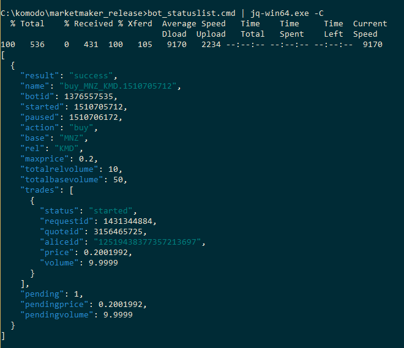

# Using MarketmakerV1 for Windows

## BarterDEX is officially deprecated as of this writing and mm2 is under testing before public release.

**Get the latest binaries from:** [Github](https://github.com/KomodoPlatform/BarterDEX/tree/dev/assets/bin/win64)
**Get the scripts from:** [Github: jl777's repository](https://github.com/jl777/SuperNET/tree/master/iguana/dexscripts.win32)

The `marketmaker` binary is essentially barterDEX-CLI

- Before starting, make sure that the scripts and following binaries are all in one folder:

  1. curl.exe (required for all scripts)
  1. marketmaker.exe
  1. libcurl.dll (required to run marketmaker)
  1. nanomsg.dll (required to run marketmaker)

- Don't forget to put `coins.json` file into a same folder. This file is available in the repo directory `Supernet/iguana/exchanges` [from here](https://github.com/jl777/SuperNET/blob/master/iguana/exchanges/coins.json).
- Type your passphrase into `passphrase` file in this folder (you should create a file with the name passphrase and without any extension) and run `1-client.cmd`. This will start the marketmaker. The next step is to obtain userpass, which will be needed by other scripts. You can simply copy and paste it from marketmaker output on startup into the `userpass` file.



- Or run `2-getuserpass.cmd` to fill the `userpass` file automatically.\*\*Note:\*\* For the other scripts to access `userpass` value, you shouldn't run any other scripts between 1-client.cmd and 2-getuserpass.cmd launching.

Sample output of correct `2-getuserpass.cmd` usage is:


You should see your `userpass` on screen, and it will also be automatically copied to the `userpass` file. It's required by all the other scripts to have this `userpass` value in the `userpass file`. If the output of `2-getuserpass.cmd` is not the same as the value showed on screen, wait some seconds and run `2-getuserpass.cmd` again. Also make sure that you have allowed marketmaker to accept incoming connections in your Windows Firewall settings (At the first time launch, your system should automatically ask for it).

- The scripts shown in the next section are examples and are there to get you started. For a reference of all the available API options, please refer to [MarketmakerV1 API.](../api/mmV1/general.md)

## Scripts

**Note:** Before you use any script that deals with any actions related to your coins (for example, withdraw and others) edit it and make sure that it has the correct addresses, coin name and volumes inside. Don't run any scripts without looking at it's source and clearly understanding what it does.

- `1-client.cmd` - used to start Marketmaker. Make sure you already have filled a strong `passphrase` into `passphrase file` as described above.

- `2-getuserpass.cmd` - fills `userpass` in `userpass file`. this step needed to use any other scripts.

- `enable.cmd` - enables the selected coin for trading.

- `balance.cmd` - displays current balance of selected coin.

- `getcoin.cmd` - prints information about a selected coin:

```json
[
  {
    "result": "success",
    "enabled": 2,
    "disabled": 70,
    "coin": {
      "coin": "KMD",
      "installed": true,
      "height": 580716,
      "balance": 72.68774305,
      "KMDvalue": 72.68774305,
      "status": "active",
      "electrum": "electrum.cipig.net:10001",
      "smartaddress": "RTCVGuoSNehKG8YYxcoskC7LK1yZhgvQRV",
      "rpc": "127.0.0.1:7771",
      "pubtype": 60,
      "p2shtype": 85,
      "wiftype": 188,
      "txfee": 10000
    }
  }
]
```

- `electrum.cmd` - Allows you to run coins in electum mode. For running more coins in electrum mode, add needed electrum servers from here : [Electrum Servers List.](./list-electrum-servers.md)

- `help.cmd` - displays help about all the available API commands.
- `listunspent.cmd` - prints your utxos.
- `bot_buy.cmd` - launches bot for buying. you'll need to set base and rel coin in script, and also maxprice and relvolume.
- `bot_list.cmd` - lists id of all running bots.
- `bot_statuslist.cmd` - list statuses of all running bots.
- `bot_stop.cmd` - stopt the bot with given bot_id.
- `withdraw.cmd` - example of `withdraw` method. you can send coins from your smartaddress to any other address using widthraw. When executed, this method generates signed raw tx in hex, which you can use with sendrawtransaction.cmd. Remember that `withdraw` only prepares the transaction, but it doesn't broadcast (send) it to network. after tx is prepared we need to send it using `sendrawtransaction` method.
- `sendrawtransaction.cmd` - sends raw transaction. you'll need a signedtx in hex.
- `withdraw_send.cmd` - combines `withdraw` and `sendrawtransaction` scripts. you can call it send, just specify coin, volume and addresses to which you want to send coins and it will prepare and broadcast transaction automatically.
- `withdraw_10_send.cmd` - example of inventory split: This script will split 10 KMD from your balance to be like an ideal Alice inventory into 10 utxos pairs (1.002, 0.00386871). Strongly recommended to read [http://pad.supernet.org/barterdex-readme](http://pad.supernet.org/barterdex-readme) -UTXO PAIRS to understand the basics. This script is just for example how you can split your coins in (X, X/777) to start trading them.

## F.A.Q

1. Is there a simple way to display JSON results returned by all scripts, like orderbook and others, in a human readable form?

   - Yes, you can use the service [JSON Editor Online](http://jsoneditoronline.org/), just copy and paste the output of script in the left column and see structured output in right.

1. I see an output like this when I run `1-client.cmd` :

   ```bash
   bind(0.0.0.0) port.7783 failed: No error sock.1468. errno.0
   bind(0.0.0.0) port.7783 failed: No error sock.1516. errno.0
   bind(0.0.0.0) port.7783 failed: No error sock.1444. errno.0
   bind(0.0.0.0) port.7783 failed: No error sock.1484. errno.0
   bind(0.0.0.0) port.7783 failed: No error sock.1412. errno.0
   bind(0.0.0.0) port.7783 failed: No error sock.1524. errno.0
   bind(0.0.0.0) port.7783 failed: No error sock.1008. errno.0
   ```

   And nothing works.

   - Before running `1-client.cmd` make sure in Task Manager that you don't already have a running `marketmaker.exe`. If you have `- kill` this process via Task Manager or via command line command `taskkill /f /im taskkill.exe` .

1. How can I pretty print JSON answers of marketmaker?

   - You can get best results with 2 tools - [conemu](https://conemu.github.io/) and [jq](https://stedolan.github.io/jq/) . conemu supports ANSI X3.64 and Xterm 256 colors and jq allow you to pretty-print json output with colors, like this:

   

   - Also it is recommended to install [Far Manager](https://www.farmanager.com/index.php?l=en) - this is a powerful console file manager for Windows, like Midnight Commander in unix.

1. What additional dependencies are required by marketmaker?

Currently `marketmaker.exe` (Windows) uses the following DLLs:

- 32 bit:

  1. libcrypto-1_1.dll
  1. libcurl.dll
  1. libssl-1_1.dll
  1. nanomsg.dll
  1. pthreadvc2.dll

- 64-bit:

  1. libcurl.dll
  1. nanomsg.dll

These are already included in the repo and are archived with the releases. Another location the Win-32 dependencies might be found: [https://artifacts.supernet.org/latest/windows/](https://artifacts.supernet.org/latest/windows/)
