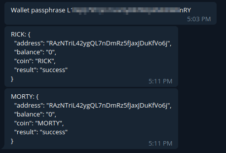
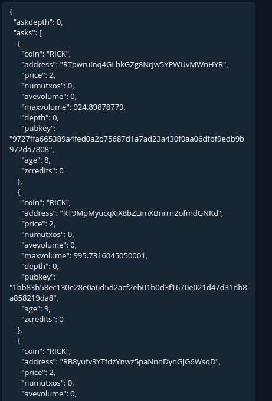

# How To Become a Liquidity Provider for AtomicDEX with Telegram Notifications using Docker

## Installation

### Clone the repository

Command:

```bash
git clone https://github.com/komodohowto/docker-atomicdex-api-marketmaker.git
```

<collapse-text hidden title="Sample Output">

```
Cloning into 'docker-atomicdex-api-marketmaker'...
remote: Enumerating objects: 20, done.
remote: Counting objects: 100% (20/20), done.
remote: Compressing objects: 100% (10/10), done.
remote: Total 20 (delta 10), reused 20 (delta 10), pack-reused 0
Unpacking objects: 100% (20/20), done.
```

</collapse-text>

### Build Docker Image

Commands:

```bash
cd docker-atomicdex-api-marketmaker/
docker build -t komodohowto/dev-marketmaker2 .
```

<collapse-text hidden title="Sample Output">

```
Sending build context to Docker daemon  99.33kB
Step 1/14 : FROM ubuntu:18.04 as build
---> 4c108a37151f
Step 2/14 : ENV BUILD_PACKAGES="build-essential git llvm-3.9-dev libclang-3.9-dev clang-3.9 cmake libssl-dev pkg-config jq curl"
---> Using cache
---> 3b813b17e4d7
Step 3/14 : RUN apt-get update &&   apt-get install -y $BUILD_PACKAGES
---> Using cache
---> 41810097bcaa
Step 4/14 : RUN curl https://sh.rustup.rs -sSf | sh -s -- -y
---> Using cache
---> 2009c98d7fa6
Step 5/14 : RUN /bin/bash -c "source $HOME/.cargo/env && rustup install nightly-2019-06-26 && rustup default nightly-2019-06-26 && rustup component add rustfmt-preview"
---> Using cache
---> a53c682998f9
Step 6/14 : RUN git clone https://github.com/KomodoPlatform/atomicDEX-API --branch mm2 --single-branch
---> Using cache
---> 8a8e51b28cc0
Step 7/14 : RUN cd atomicDEX-API && /bin/bash -c "source $HOME/.cargo/env && cargo build --features native -vv"
---> Using cache
---> adfcc059873e
Step 8/14 : FROM ubuntu:18.04
---> 4c108a37151f
Step 9/14 : RUN apt-get update &&   apt-get install -y git jq wget curl nano
---> Using cache
---> 2dd149bda261
Step 10/14 : RUN cd /usr/local/bin && wget https://raw.githubusercontent.com/jl777/coins/master/coins
---> Using cache
---> e9184dd1aaeb
Step 11/14 : COPY --from=build /atomicDEX-API/target/debug/mm2 /usr/local/bin
---> Using cache
---> 28f19909035f
Step 12/14 : COPY /scripts/* /usr/local/bin/
---> Using cache
---> a1d73142edd9
Step 13/14 : COPY entrypoint.sh /usr/local/bin/
---> Using cache
---> 67edd3956442
Step 14/14 : CMD ["/usr/local/bin/entrypoint.sh"]
---> Using cache
---> dad149e9d795
Successfully built dad149e9d795
Successfully tagged komodohowto/dev-marketmaker2:latest
```

</collapse-text>

## Setup Telegram Bot

- Open your Telegram App.
- Search for the bot named `@BotFather` and start a chat with it
- Send the message `/help` to receive a list of commands available
- Send the message `/newbot` to create a new bot
- Send a message containing the required name of the bot. It must end in `bot`. Like this, for example: TetrisBot or tetris_bot.
- Once the bot is created, take note of the username (hereby referred as `BOT_USERNAME`) and bot token (hereby referred as `BOT_TOKEN`) from the message sent to you.
- Go to the url: `https://api.telegram.org/bot<YourBOTToken>/getUpdates`. Replace the `<YourBOTToken>` with the `BOT_TOKEN`, noted from the previous step.
- In the response, look for the key: `chat`

```json
"chat": {
"id": 757608348,
"first_name": "Gurucharan",
"type": "private"
},
```

- the id in the above json is hereby referred as `BOT_CHATID`

Now we have all the details needed to start our Marketmaker with Telegram bot notifications enabled!

## Usage

### Start Container With Telegram Bot Notification

Command:

```bash
docker run -it -e BOT_TOKEN='989XXXXXX:AAXXXXXXXXXXXXeso' -e BOT_CHATID='93XXXXX6' -e BOT_USERNAME='mymarketmakerbot' komodohowto/dev-marketmaker2
```

Replace the values `BOT_TOKEN='989XXXXXX:AAXXXXXXXXXXXXeso' -e BOT_CHATID='93XXXXX6' -e BOT_USERNAME='mymarketmakerbot'` with the ones belonging to your bot

A message will be received on your bot like this:


### Start Atomic DEX API Marketmaker

Command:

```bash
start.sh
```

<collapse-text hidden title="Sample Output">

```
root        30 17.5  3.8 879940 154996 pts/0   Sl+  10:09   0:00 /usr/local/bin/mm2 {"gui":"MM2GUI","netid":9999, "userhome":"/root", "passphrase":"L1XXXXXXXXXXXXXXXXXXXRY", "rpc_password":"HlXXXXXXXKW"}
```

</collapse-text>

This outputs the PID within the docker container, the passphrase & the rpc_password that is used with the packaged scripts.

### Connect to RICK & MORTY Coin Networks

Commands:

```bash
RICKconnect.sh
MORTYconnect.sh
```

The helpful telegram bot sends this notification for this demo:



### View RICK/MORTY Orderbook

Command:

```bash
RICKMORTYorderbook.sh
```

Which our bot helpfully relays to us!



Now that we can see the orderbooks are in a simple JSON schema, it is trivial to create a rudimentary GUI application.
